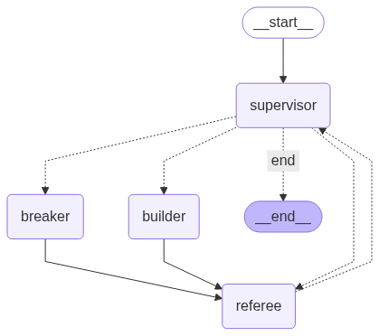

# Results — duel-09297099
*Generated on 2025-08-17 14:38:25*



## Artifacts
- [breaker_ideas.json](duel_logs/duel-09297099/breaker_ideas.json)
- [breaker_pytest.txt](duel_logs/duel-09297099/breaker_pytest.txt)

---
## Highlights

<details><summary><code>breaker_ideas.json</code></summary>

**Breaker ideas (ToT)**

```json
{
  "ideas": [
    {
      "title": "stringy.py",
      "file": "tests/test_basic.py",
      "summary": "assert stringy('') == 'stringy'",
      "style": "pytest"
    },
    {
      "title": "calculator.py",
      "file": "tests/test_basic.py",
      "summary": "assert calculator(5, 3) == 1.6666666666666666",
      "style": "pytest"
    },
    {
      "title": "test_basic.py",
      "file": "tests/test_basic.py",
      "summary": "assert basic() == 'Hello, World!'",
      "style": "pytest"
    }
  ],
  "selected": 0
}
```
</details>

<details><summary><code>breaker_pytest.txt</code></summary>

**Pytest result (Breaker quick run)**

```text
...                                                                      [100%]
3 passed in 0.20s
```
</details>
